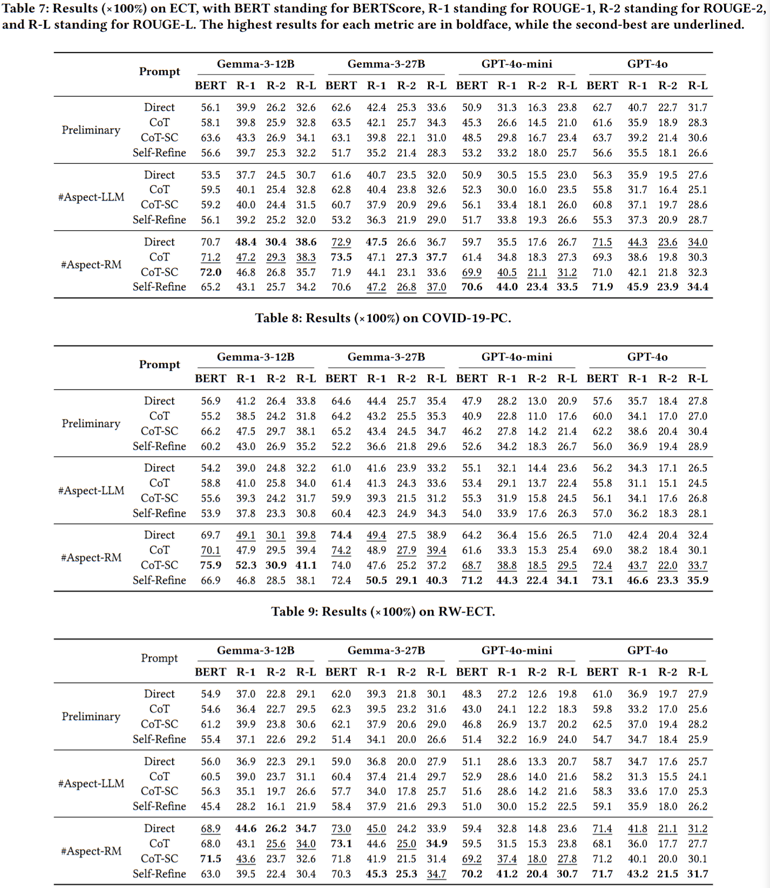
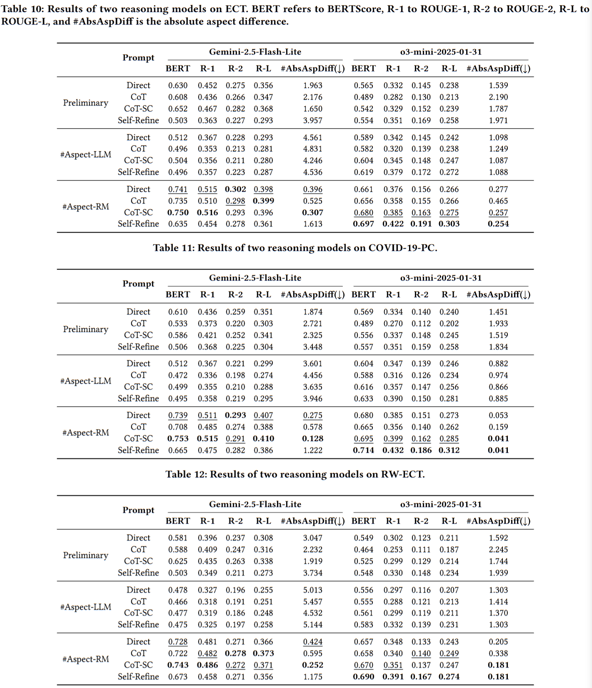

# CARPAS- Towards Content-Aware Refinement of Provided Aspects for Summarization in Large Language Models

Project Features:
- ✅ Synthetic Data Generation
- ✅ Direct / Chain-of-Thought / Self-Consistency Prompting
- ✅ LangGraph Multi-step Reasoning (Agentic)
- ✅ Multi-dimensional Auto-Evaluation (LLM + BERTScore)📦 

---

## 📊 Additional Experimental Results

### A.1 Quantitative Results
Tables 7, 8, and 9 present the complete evaluation metrics, including BERTScore, ROUGE-1, ROUGE-2, and ROUGE-L, for the three datasets. The **#Aspect-RM** outperforms both the Preliminary Experiments and the #Aspect-LLM. Furthermore, GPT-based models achieve their best performance when paired with the Self-Refine strategy.



### A.2 Additional Models
We additionally run experiments with two other reasoning models, **o3-mini** and **Gemini-2.5-Flash-Lite**, on the three datasets. As shown in Tables 10, 11, and 12, #Aspect-RM continues to achieve the highest scores, and o3-mini demonstrates the best performance under the Self-Refine strategy.



---

## Project Overview
```
├── Finance/
├── Covid/
├── Real_word_data/
├── requirements.txt
└── README.md
```

### 📁 Datasets
This project includes three datasets:
| Dataset | Description |
|------|------|
| `Finance/` | Synthetic financial reports |
| `Covid/` | Pandemic / Public health reports |
| `Real_word_data/` | Real-world documents|

## 📂 Dataset Structure (Common)
```
Dataset/
├── Method/           # LLM inference and summarization methods
├── Result/           # Model outputs and evaluation results
└── Synthetic_data/   # Synthetic data generation and splitting
```

## 🧬 Synthetic_data — Synthetic Data Generation

### 🎯 Function
Uses LLMs (Gemini / GPT) to generate long documents with controlled aspect structures as sources for experiments.

### 🔑 Key Files
| File | Function |
|----|----|
| `data_generation_gemini.py` | Uses Gemini to generate synthetic documents and aspect summaries |
| `report_template.py` | aspect pool and topic templates |
| `transcript_template.py` | Document structure templates (e.g., earnings calls) |
| `data_split.py` | Splits data into train / test |
| `train.json` | List of training data paths |
| `test.json` | List of testing data paths |

### ▶️ Generating Synthetic Data
Generate 20 documents, each containing 4 aspects:
```Bash
cd Finance/Synthetic_data
python data_generation_gemini.py \
  --num_sample 20 \
  --num_aspect 4
  ```

Output format (each .json):
```JSON{
  "document": "... long document ...",
  "aspects": ["Aspect A", "Aspect B"],
  "aspect_summary": {
    "Aspect A": "summary...",
    "Aspect B": "summary..."
  }
}
```
These files are stored according to the model and aspect count, for example:
```
Synthetic_data/
└── gemini-2.0-flash/
    └── 4/
        ├── sample_1.json
        ├── sample_2.json
        └── ...
```

### Data Filtering & Split
Since synthetic data may contain:
- Incomplete documents
- Aspect summaries with negative/invalid descriptions
- Empty or low-quality content
Data filtering and splitting must be performed before formal experiments.

🔑 Key File:
| File | Function |
|----|----|
| data_split.py | Filters low-quality data and generates train.json / test.json |

## 🧠 data_split.py Filtering Logic
`data_split.py` executes the following filtering and splitting workflow:
### ① Collect Qualified Test Data
- Collects all .json files from the gemini_filtered_data/ directory.
- Serves as the fixed source for the test set.
### ② Filter Original Synthetic Data
Data is excluded in the following cases:
- The aspect summary contains negative phrases (e.g., "does not").
- The document content is empty.
- The JSON file cannot be parsed correctly.
### ③ Prevent Data Duplication
- Ensures no overlap between train data and test data.
- Prevents data leakage to ensure experimental fairness.
### ④ Output Data Lists
- train.json: List of filtered high-quality training / warm-up data paths.
- test.json: Fixed test data list used for subsequent Prompt / LangGraph evaluation.

---

## 🏢 Multi-Category Synthetic Data Generation

### Overview
Extended data generation pipeline supporting **20 industry categories** with balanced aspect distribution.

| Metric | Value |
|--------|-------|
| Total Categories | 20 |
| Samples per Category | 50 |
| Total Samples | **1,018** |
| Aspect Distribution | 10 samples each for 4, 5, 6, 7, 8 aspects |

### 📊 Industry Categories

| Sector | Categories |
|--------|------------|
| **Technology** | software_saas, cloud_computing, ecommerce, cybersecurity |
| **Energy** | oil_gas, renewable_energy, utilities |
| **Financial** | banking, insurance, asset_management |
| **Healthcare** | pharma_biotech, medical_devices, healthcare_services |
| **Consumer** | consumer_goods, retail, food_beverage |
| **Industrial** | automotive, aerospace_defense, manufacturing |
| **Telecom** | telecom |

### 🔑 Key Files

| File | Function |
|------|----------|
| `company_categories.py` | Defines 20 categories with industry-specific aspects |
| `generate_industry_templates.py` | LLM-powered template generation |
| `data_generation_multi_category.py` | Multi-category data generation with Pydantic structured output |
| `gen_all_categories.sh` | Batch script for all 20 categories |
| `data_stats.py` | Statistics by category and aspect count |
| `data_split.py` | Stratified train/test split |

### ▶️ Generate Multi-Category Data

```bash
cd Finance/Synthetic_data

# Generate for a single category
python data_generation_multi_category.py \
  --category software_saas \
  --num_sample 50

# Generate for all 20 categories (1000 samples)
./gen_all_categories.sh
```

### 📁 Output Structure
```
output/
├── software_saas/
│   ├── sample_001_4aspects.json
│   ├── sample_002_5aspects.json
│   └── ...
├── oil_gas/
├── banking/
└── ... (20 categories)
```

### 📊 Run Statistics & Split
```bash
# Generate statistics
python data_stats.py

# Train/test split (80/20)
python data_split.py
```

---

## ▶️ Execute Data Filtering and Split
```Bash
cd Finance/Synthetic_data
python data_split.py
```

---

## 🧠 Method — Aspect Summarization
### Two Main Approaches
| Method           | File                    | Features                          |
| ------------ | --------------------- | --------------------------- |
| Prompt-based | `prompt.py`           | Direct / CoT / CoT Self-Consistency |
| Agentic-based  | `langgraph_guided.py` | Self-Refine Prompt             |

---

## 🧩 prompt.py — Prompt-based Method

### 🔹 Supported Modes 

| `cot_mode` | Description                        |
| ---------- | ------------------------- |
| `direct`   | Direct output without reasoning                  |
| `cot`      | Chain-of-Thought          |
| `cot_sc`   | Self-Consistency (Sampling multiple times and aggregating) |

### 🔹 Parameters y / n

| Parameter | Meaning                               |
| --- | -------------------------------- |
| `y` | Number of correct aspects sampled from the ground truth |
| `n` | Number of randomly added irrelevant aspects              |

→ Used to test the model's ability to **filter incorrect topics and complete missing topics.**

### ▶️ Execution Examples

- Execute Preliminary with Direct Prompt
```Bash
cd Covid/Method

python prompt.py \
  --cot_mode direct \
  --model gpt-4o \
  --y 2 \
  --n 2 \
```

- Output Location:
```
Result/
└── cot_sc_prompt_with_predicted_aspect/
    └── gemini_filtered_data_y2n2/
        └── gpt-4o/
            └── 4_sample_12.json
```

- Execute #Aspect-LLM with CoT-SC
```Bash
cd Covid/Method

python prompt.py \
  --cot_mode cot_sc \
  --model gemini-2.5-flash-lite \
  --y 2 \
  --n 2 \
  --gemini_api_key YOUR_GEMINI_API_KEY \
  --provide_aspect_num \
  --aspect_source predict
```

- Output Location:
```
Result/
└── cot_sc_prompt_with_predicted_aspect/
    └── gemini_filtered_data_y2n2/
        └── gemini-2.5-flash-lite/
            └── 4_sample_12.json
```
- Execute #Aspect-RM with CoT
```Bash
cd Covid/Method

python prompt.py \
  --cot_mode cot \
  --model gemma-3-12b \
  --y 2 \
  --n 2 \
  --gemini_api_key YOUR_GEMINI_API_KEY \
  --provide_aspect_num \
  --aspect_source csv
```

- Output Location:
```
Result/
└── cot_prompt_with_csv_aspect/
    └── gemini_filtered_data_y2n2/
        └── gemma-3-12b/
            └── 4_sample_12.json
```

---

## 🔗 langgraph_guided.py — Self-Refine Prompt

### 🔹 Workflow Concept
1. Check coverage: Determine if current aspects cover the key points of the article.
2. Revise aspects: Retain / Modify / Delete / Add aspects.
3. Iterate: (Max ~14 steps).
4. Summarize aspects.

### ▶️ Execution Examples
- Execute Preliminary
```Bash
cd Covid/Method

python langgraph_guided.py \
  --model gpt-4o-mini \
  --memory False \
  --y 2 \
  --n 2 \
  --api_key YOUR_OPENAI_API_KEY
```

- Output Location:
```
Result/
└── langgraph/no_memory/
    └── gemini_filtered_data_y2n2/
        └── gpt-4o-mini/
            └── 4_sample_12.json
```

- Execute #Aspect-LLM
```Bash
cd Covid/Method

python langgraph_guided.py \
  --model gpt-4o-mini \
  --memory False \
  --y 2 \
  --n 2 \
  --provide_aspect_num \
  --aspect_source predict \
  --api_key YOUR_OPENAI_API_KEY
```

- Output Location:

```
Result/
└── langgraph_prompt_with_predicted_aspect/no_memory/
    └── gemini_filtered_data_y2n2/
        └── gpt-4o-mini/
            └── 4_sample_12.json
``` 

- Execute #Aspect-RM
```Bash
cd Covid/Method

python langgraph_guided.py \
  --model gpt-4o-mini \
  --memory False \
  --y 2 \
  --n 2 \
  --provide_aspect_num \
  --aspect_source csv \
  --api_key YOUR_OPENAI_API_KEY
```

- Output Location:
```
Result/
└── langgraph_prompt_with_csv_aspect/no_memory/
    └── gemini_filtered_data_y2n2/
        └── gpt-4o-mini/
            └── 4_sample_12.json
```

---

## 📊 Result — Model Output

Each output .json contains:

```JSON
{
  "document": "...",
  "ground_truth_aspects": [...],
  "ground_truth_aspect_summary": {...},
  "provided_aspects": [...],
  "generated_revised_aspects_summary": {...},
  "pairing": {...},
  "metrics": {...},
  "total_steps": 4,
  "total_tokens": 12021,
  "predicted_aspect_num": 2
}
```

## 📏 Chat Evaluation — Auto-Evaluation
🔍 Metrics

| Metric           | Description                      |
| ---------------- | ----------------------- |
| Factuality       | LLM judgment on whether the summary is faithful to the original text |
| Relevance        | aspect coverage + Reasonableness of quantity |
| Aspect BERTScore | Semantic alignment of aspect names |

### ▶️ Execute Evaluation
```Bash
cd Covid/Method
python chat_eval.py
```

Results will be written to:
```
Result/Chat_eval/...
```

---


## ⚙️ Environment Setup

```Bash
pip install -r requirements.txt
```
`.env` needs to include (depending on the models used):

```env
OPENAI_API_KEY=...
GEMINI_API_KEY=...
```

## 🔁 Recommended Workflow (Quick Start)
```
1. Synthetic_data/
   ├── data_generation_gemini.py
   └── data_split.py

2. Method/
   ├── prompt.py
   └── langgraph_guided.py

3. Method/
   └── chat_eval.py
```

## 🔢 train_ddp.py — Aspect Count Prediction Model (DDP Training)

`train_ddp.py` is used to train a **document-level Aspect Number Prediction Model**, aimed at automatically predicting the number of aspects a document should contain based on the full text.

The prediction results from this model can be used:
- As an aspect count hint in `prompt.py` / `langgraph_guided.py`.
- To assist the LLM in generating "reasonable quantities (neither too many nor too few)" of aspects.
- To reduce hallucination and the issue of over-fragmenting topics.

### 🧠 Model Concept

- **Task Type**: Regression
- **Input**: Full document
- **Output**: Number of aspects for the document (Integer)
- **Loss**: L1 Loss (MAE)
- **Evaluation Metrics**:
    - MAE (Mean Absolute Error)
    - Rounded Accuracy (Whether the prediction is correct after rounding)

### 🏗 Model Architecture
- **Base Model**: Qwen/Qwen3-Embedding-0.6B
- **Pooling**: Mean Pooling over token embeddings
- **Head**: MLP Regression Head
- **Fine-tuning Method**: LoRA (PEFT) - Fine-tuning only attention / MLP sub-modules
- **Training Method**: Supports Single GPU / Multi-GPU Distributed Data Parallel (DDP)


### 📂 Training Data Source
- Generated by `Synthetic_data/data_split.py`:
    - `train.json`
    - `test.json`
- Each entry contains:
    - `document`
    - `aspects` (Used to calculate ground-truth aspect count)

---

### ▶️ Train Model

```
cd Covid/Method

python train_ddp.py \
  --mode train \
  --output_dir aspect_count_model
```